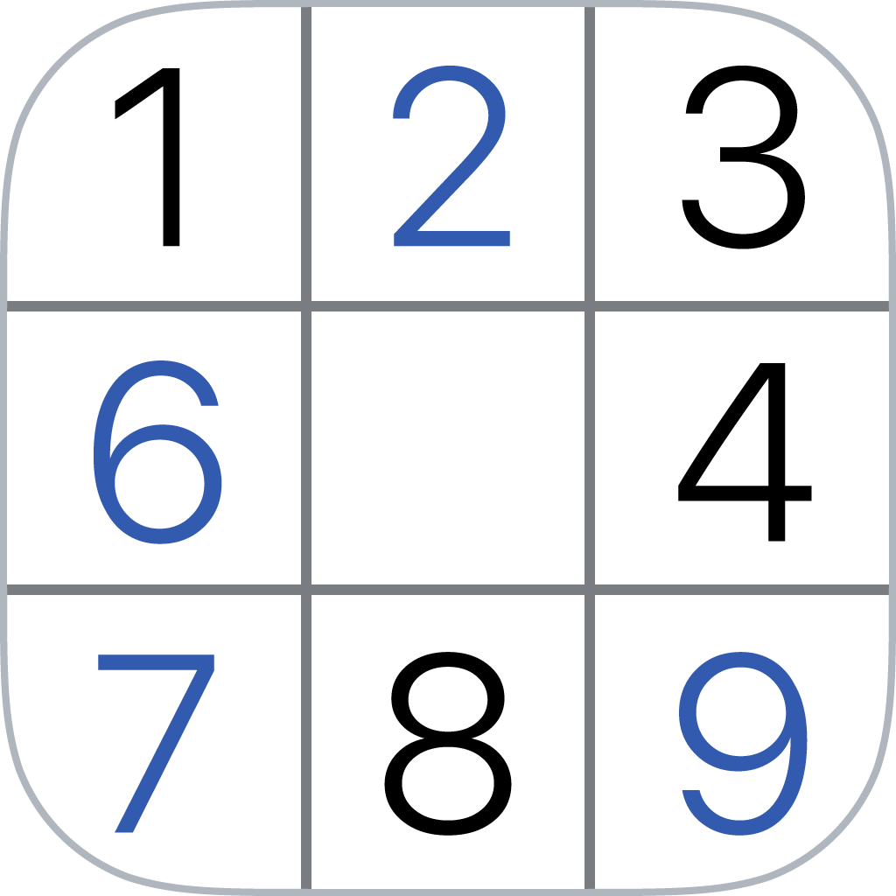
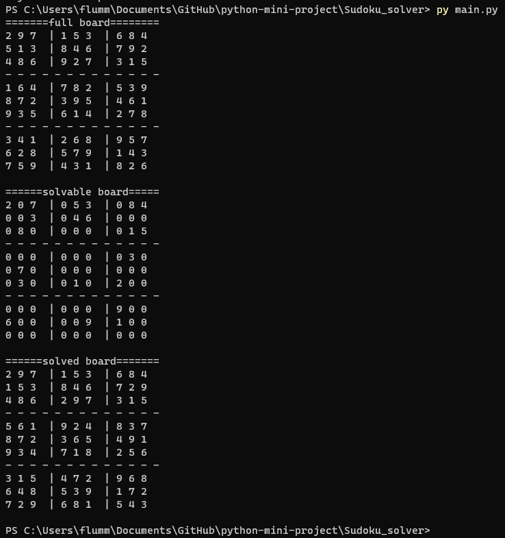

# Sudoku solver

## 🛠️ Description
<!--Remove the below lines and add yours -->
This program can generate and solve Sudoku boards.

## ⚙️ Languages or Frameworks Used
<!--Remove the below lines and add yours -->
You only need Python to run this script. You can visit [here](https://www.python.org/downloads/) to download Python.

## 🌟 How to run
<!--Remove the below lines and add yours -->
By default, it generates a board and solves it straight away.

If you want to get your own board solved you have to look at the bottom of the file.
Just fill in the number of your board and use a comment to disable the board generator below.

## 📺 Demo
